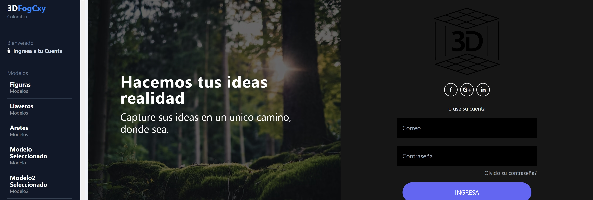

# 3dFogCxy DashBoard Angular 17 Con SSR

[Angular CLI](https://github.com/angular/angular-cli) version 17.0.5.

## Build
- Compila tu aplicación para producción. Abre una terminal en el directorio raíz de tu proyecto y ejecuta el siguiente comando:
ng build --configuration production

- El servidor va a mostrarte la aplicación Angular, a pesar de que no haya un archivo index.html. 
- Esto se debe a que el archivo prerendered-routes.json contiene una lista de todas las rutas de la aplicación Angular. 
- El servidor usa esta lista para encontrar el archivo HTML prerenderizado correspondiente a la ruta solicitada.
- La carpeta browser contiene los archivos HTML prerenderizados para las rutas que se cargan en el navegador. 
- La carpeta server contiene los archivos HTML prerenderizados para las rutas que se cargan en el servidor.

